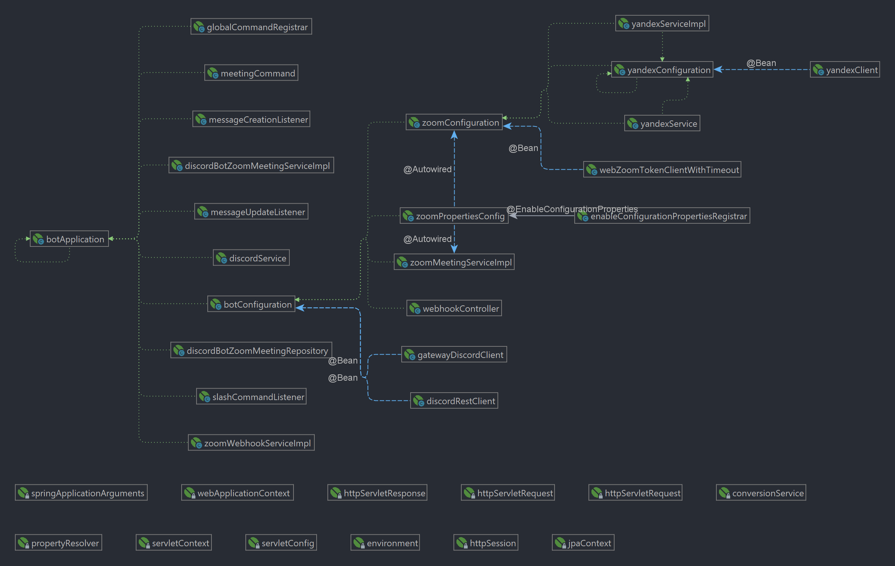
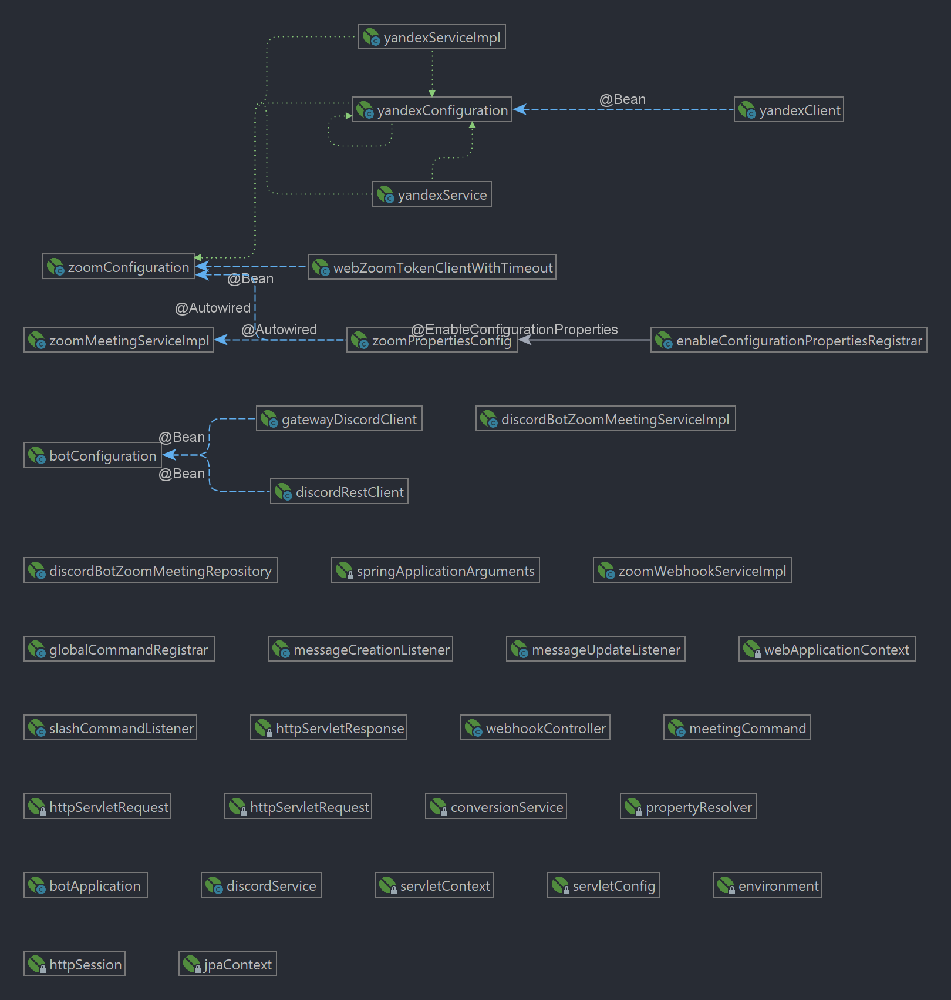
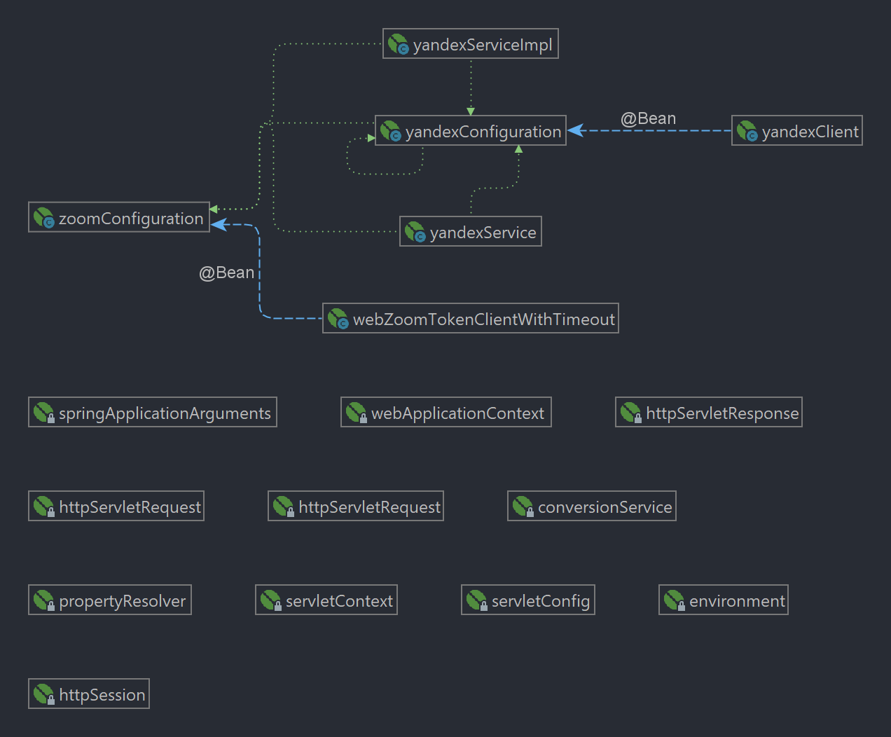
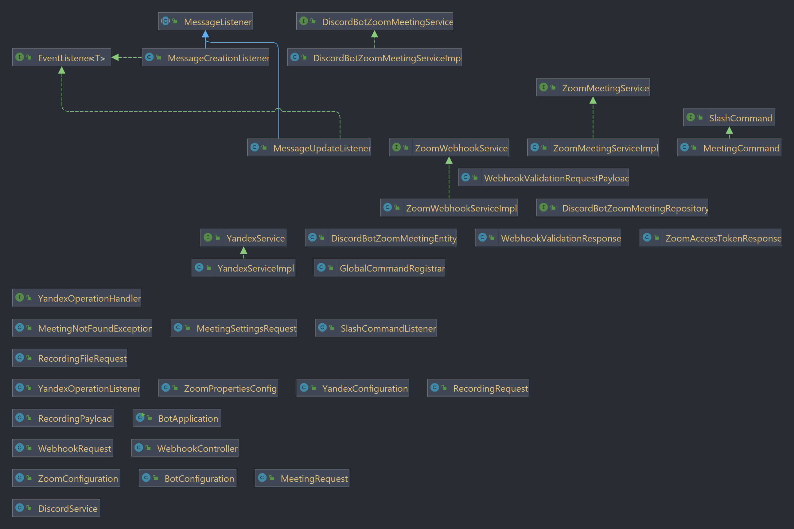

# MSE-2023-core-admin_automation-22

## Функционал
+ Дискорд-бот, который создаёт ссылки на конференции zoom и, по окончании конференции, загружает запись на Яндекс-диск.

## Запуск
+ git clone https://github.com/moevm/MSE-2023-core-admin_automation-22.git
+ cd MSE-2023-core-admin_automation-22
+ Заполнить файл ```.evn.example``` и переименовать его в ```.env```
+ docker-compose up -d

## Архитектура
Проект состоит из 3-х модулей:
+ модуль ```bot```: данный модуль представляет собой точку входа в приложение, имеет основные методы для отправки и чтения сообщений, репозитории, сущности, а также config discord4j и slashCommands.

+ модуль ```zoom```: в данном модуле реализован сервис для создания конференции, вебхук для проверки валидации запроса и окончания конференции.

+ модуль ```yandex```: отвечает за загрузку записи с zoom на Яндекс-диск.

+ зависимости классов:

